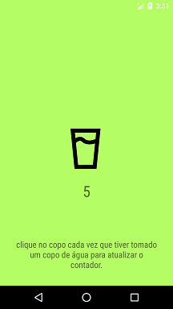

# Drink Water Service Example
Projeto desenvolvido no curso "Trabalhando com processamento assíncrono no Android" do bootcamp everis Kotlin Developer da [Digital Innovation One](https://digitalinnovation.one).

Este aplicativo aborda o uso de Intent Services no Android para iniciar a execução de um *Service* em segundo plano. O service atualiza dados armazenados na SharedPreferences quando o usuário clica em um botão na interface de usuário. O aplicativo recebe o evento de alteração da SharedPreferences e atualiza os dados em um TextView.

## Instruções
Faça o clone ou download do projeto no seu computador e execute o aplicativo no Android Studio.

## Screenshots
